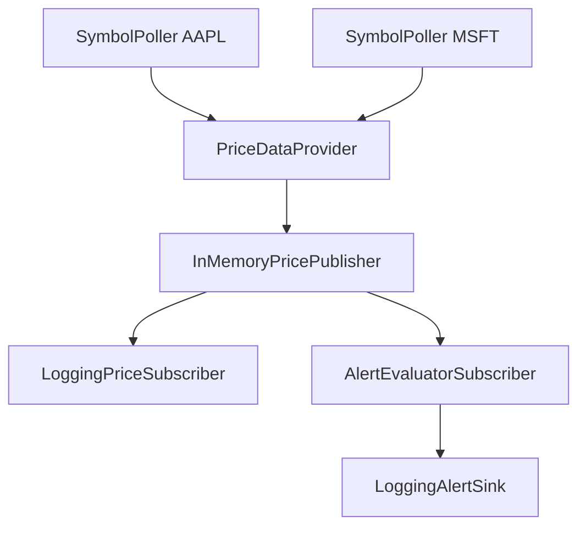

# Secure-Stock-Price-Alert-System

A real-time stock price alert system built in Java, focused on clean OOP design, the Observer pattern, multithreading, reliability (retry with exponential backoff), and extensibility.

### Features
- Multithreaded per‑symbol polling workers
- Observer pattern (PricePublisher → PriceSubscriber)
- Pluggable data providers (fake + Finnhub)
- Retry with exponential backoff for transient failures
- Threshold alerts (above/below) with crossing detection (no alert spam)
- Logging sink for alerts/events

### Architecture

> [!NOTE]
> Each SymbolPoller (one per symbol) fetches prices from the PriceDataProvider, publishes PriceQuote, updates through the InMemoryPricePublisher, and subscribers either log updates (LoggingPriceSubscriber) or evaluate rules (AlertEvaluatorSubscriber) to emit alerts to the LoggingAlertSink.

### Project Milestones
- Domain model + interfaces
- Observer wiring + in-memory publisher
- Multithreaded pollers + graceful shutdown
- Finnhub provider + JSON parsing
- Retry/backoff reliability
- Crossing threshold alerts

### Getting started
- #### Prereqs
  - Java 17
  - Maven
- #### Configure (Finnhub)
  - Create a .env file:
    - FINNHUB_API_KEY=...
  - In VS Code, run using the launch config that loads .env (envFile).
- #### Run
  - Run App from VS Code (Run/Debug) or build/run with Maven.

### Tech
Java 17, Maven, Finnhub API, Gson, OOP, Observer pattern, multithreading, retry/backoff
